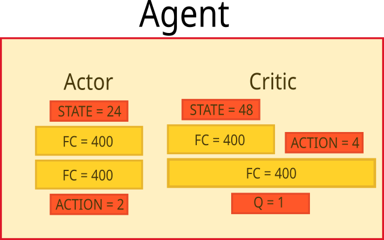
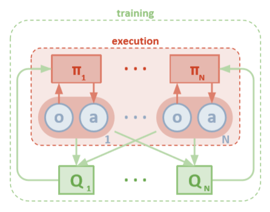
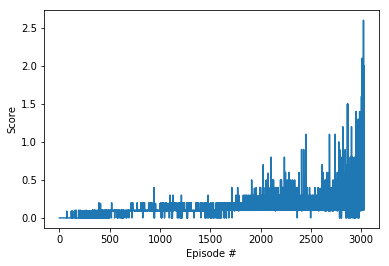

# Report

## Learning Algorithm

To solve Collaboration and Competition project, I used as a start point the code from my https://github.com/jigor/DRLND_Project2_Continuous_Control project that implements Deep Deterministic Policy Gradients (DDPG) algorithm. Original code is customized to work with multi agent environment and implement MADDPG algorithm. Main reference for customization was paper https://arxiv.org/pdf/1706.02275.pdf.

DDPG is using the actor-critic architecture, Actor is used to decide the best action for a specific state and the Critic is used for evaluating action. DDPG is also using target network with soft update for both Actor and Critic and experience replay buffer.

Ornstein-Uhlenbeck random process is used for adding noise to action so the agent has more exploration of action space. Parameters of Ornstein-Uhlenbeck process are

```Python
seed = 2
mu = 0.0
theta = 0.25
sigma = 0.35
```
In this project I am using Tennis environment with 2 agents. The main part of the program is in following files

```Python
ddpg_agent.py
model.py
Tennis.ipynb
```

*ddpg_agent.py* code implements an environment-aware agent, while in *model.py* are the neural network models of Actor and Critic.
*Tennis.ipynb* contains a code that trains a agent and displays results.

#### MADDPG  algorithm with Actor - Critic networks
The model of the neural network used is shown in the picture:



I used a two layers network for the Actor

The size of the hidden layers are:
FC1 size = 400
FC2 size = 400

The input parameter is the state of the environment (size 24) and the output is action (size 2).

For the Critic, I also used a two layers network
FCS1 size = 400
FC2 size = 400 

Input parameters are states (size 48) in first layer and actions (size 4)  in second layer and output is Q  value (size 1).

The activation function is *relu* on output of all hidden layers of Actor, except on the last layer of Actor where I used tanh (because the action values are in range [-1.1]). Critic is using *leaky_relu* activation function in all layers except the last layer, where I did not use any activation function because the output is Q value.

The hyper parameters are: 

```Python
BUFFER_SIZE = int(1e5)  # replay buffer size
BATCH_SIZE  = 128       # minibatch size
GAMMA = 0.99            # discount factor
TAU = 1e-3              # for soft update of target parameters
LR_ACTOR = 1e-4         # learning rate of the actor 
LR_CRITIC = 1e-4        # learning rate of the critic
WEIGHT_DECAY = 0        # L2 weight decay
WARMUP_TIME = 1024     # initial experience buffer fill time
```

Learning rates of Actor and Critic are decreased for this project to stabilize learning. *WARMUP_TIME* is much lower than in base project. I was experimenting with changing TAU hyperparameter and with using hard update for target networks, but that did not give a result. 
Other hyper parameters have the same values as in the original project.

As the paper [1706.02275](https://arxiv.org/pdf/1706.02275.pdf) propose, I have changed DDPG's agent, so Actor only has insight into its observation, while Critic has insight into the state and action of both agents, which can be seen in the picture underneath from mentioned paper.



The Critic in MADDPG learns a centralized action-value function 
$$
Qi(o⃗ ,a1,…,aN)
$$
for the i-th agent, where 
$$
a1∈A1,…,aN∈AN
$$

$$
o⃗ =o1,…,oN
$$

are actions and observations of all agents. Each Qi is learned separately for i=1,…,N and therefore multiple agents can have arbitrary rewards, including conflicting rewards in a competitive setting. At the same time multiple actors, one for each agent, are exploring and upgrading the policy on their own.

Algorithm solves environment in 3025 episodes. Partial log and plot of rewards can be seen below:

	Episode 100	Average Score: 0.00	 Score: [ 0.   -0.01]
	Episode 200	Average Score: 0.01	 Score: [-0.01  0.  ]
	.
	.
	.
	Episode 1000	Average Score: 0.11	 Score: [0.1  0.19]
	.
	.
	.
	Episode 2000	Average Score: 0.17	 Score: [0.2  0.09]
	.
	.
	.
	Episode 3025	Average Score: 0.50	 Score: [1.89000003 2.00000003]
	Environment solved in 3025 episodes!	Average Score: 0.50




## Ideas for Future Work 	
In the next step I planed to try to optimize and speed up learning using network model with less parameters and better hyperparameters optimizations. Implementation of the Prioritized Experience Replay algorithm [https://arxiv.org/pdf/1511.05952](https://arxiv.org/pdf/1511.05952), I think will improve results also. After MADDPG optimization I will try to implement Proximal Policy Optimization (PPO) algorithm and to compare results with MADDPG.

## References

1. [https://arxiv.org/pdf/1706.02275.pdf](https://arxiv.org/pdf/1706.02275.pdf)
2. [https://lilianweng.github.io/lil-log/2018/04/08/policy-gradient-algorithms.html#maddpg](https://lilianweng.github.io/lil-log/2018/04/08/policy-gradient-algorithms.html#maddpg) 
3. [https://medium.com/@scitator/run-skeleton-run-3rd-place-solution-for-nips-2017-learning-to-run-207f9cc341f8](https://medium.com/@scitator/run-skeleton-run-3rd-place-solution-for-nips-2017-learning-to-run-207f9cc341f8)